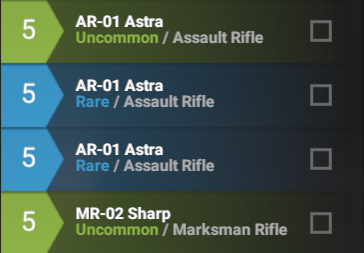

Phantom Brigade Equipment Type and Rarity Change

# Description
Changes the following:
* Item display from "Rarity / Item Type" to either "Item Type" or "Item Type / Rarity".
* Adds a "Group by Alpha" sort in the inventory.


# Rarity Type Text Change
The goal is to make it easier to find sections of the same type of item quickly.  The user can choose between showing the Item Type, or the Item Type and Rarity.

## Original:


## Item Type Only:


## Item Type and Rarity:


# Alpha Group
Adds a sort called "Alpha Group" to the sort options on the inventory screen.  This sorts the inventory alphabetically by the item's group name.

For example, Assault Rifle will be at the top of the list and Sub Machine Gun at the bottom.  

The goal is to speed up locating an item in a large inventory when a user already knows the type they are looking for.


# Mod Compatibility
This mod is safe to add and remove from existing saves.

# Settings
In the metadata.yaml file, the following settings are available in the modSettings section:


|Setting|Default|Description|
|--|--|--|
|showRarity|false|If true, will show item "type / rarity".  Otherwise only the type is shown.|
|EnableGroupByAlpha|true|If true, will add the "Group By Alpha" alphabetical sort in the inventory.|

# Installation

Warning - Phantom Brigade is in Early Access and may change at any time, which may break this mod.

Any bug reports for modded games will be ignored by the developers. 

## Install the Mod

Download the mod's zip file and extract to the following directory:

``%HOMEDRIVE%%HOMEPATH%\Documents\My Games\Phantom Brigade\Mods\``

## Enable The Mod in Phantom Brigade

If the Mods option does not show up in the game, complete the steps in the [enable mods](#configure-phantom-brigade-to-enable-mods) section.

On the main screen, click the mods icon:


Click the Arrow on the mod to move the mod to the Config section


Click the Save Config button


Click the Exit to Desktop button


Relaunch the game.

The mod will now be enabled.

## Configure Phantom Brigade to Enable Mods

This section is only required if Phantom Brigade has not already been configured to enable mods.

### Setup Game Mod Configuration
Create new file named mods.yaml in the folder ``%HOMEDRIVE%%HOMEPATH%\Documents\My Games\Phantom Brigade\Settings``

In the mod.yaml file, copy the following text and save:

```
enabled: true
loadFromApplicationPath: false
list: []
```
### Create Mods folder
Create a new folder named Mods in ``%HOMEDRIVE%%HOMEPATH%\Documents\My Games\Phantom Brigade\``
